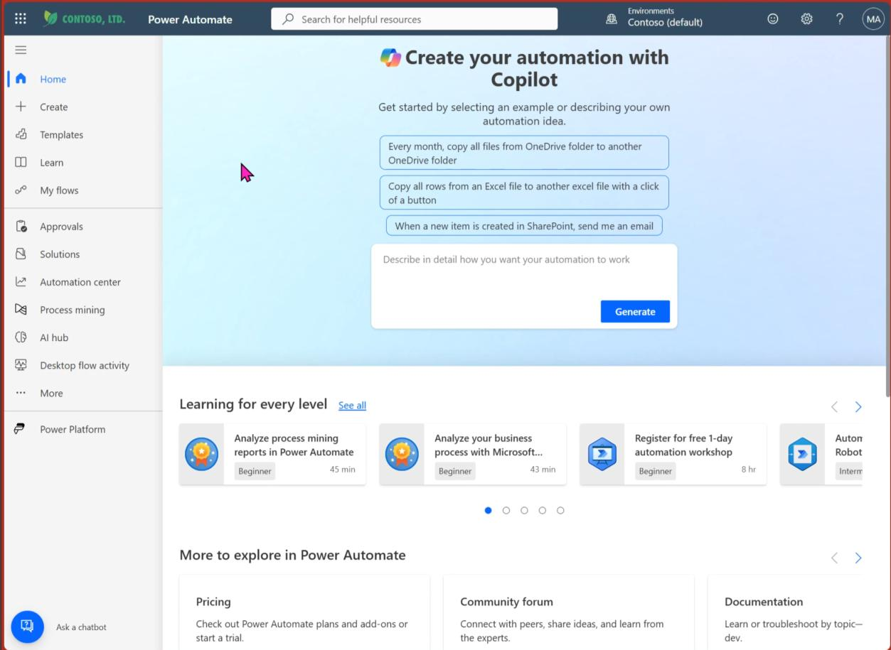
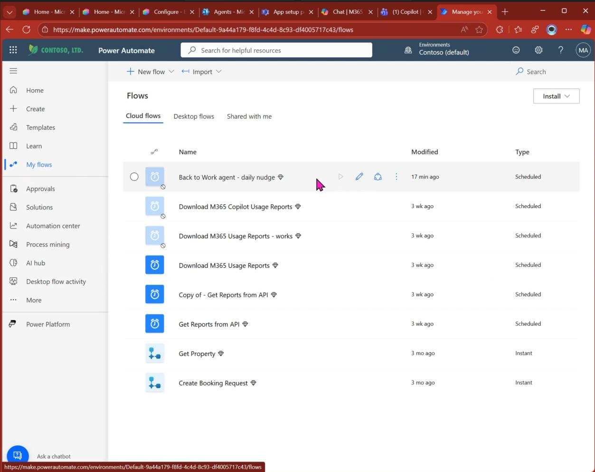

# Daily Nudge Setup

Heading to the proactivity which we all want! Sometimes you might be in a rush — or just totally into other topics. Nevertheless, as an organization, we want to make sure that **everyone gets the most out of AI at work**.

We are approaching the final steps for **proactive outreach** to the users!

---

## Open Power Automate

Go to the Power Automate Maker Portal: [https://make.powerautomate.com/](https://make.powerautomate.com/)

With the import of the solution, you already have everything you need. Go directly to **"My Flows"**.

---

## Find the Daily Nudge Flow

You'll see a list of all your flows. Within the list should be **"Back to Work agent – daily nudge"**.

As you only imported it but did not activate until now, it is somewhat greyed out. Click on it to enter the details page.

---

## Configure User Targeting

If you are interested in the logic, you can walk through the Flow in all its detail. For now, we just want to make sure the functionality works.

> **Quick Info:** The proactive reach-out can use two different ways to identify the usernames it reaches out to:
> - **Entra ID Group** (highly recommended)
> - **Excel File** in SharePoint

### Option A — Entra ID Group (Recommended)

Update the **Group ID** by using the `objectID` from Entra ID in Action: **"Group Id or Excel File"**.

You can use whichever Entra ID group you've got — whether it's "all users" or a specified group if you are working in waves.

### Option B — Excel File

1. Upload Excel template with email addresses to OneDrive or SharePoint Online
2. Update Excel action **two times** in Power Automate Flow (inside Condition)
3. Double-check that the GroupID is still `00000...`

---

## Turn On Your Agent

This is the last step — **activate the flow!**

---

## Optional: Customize Daily Nudge Messages

Update or remove daily nudge texts in action: **"Initialize variable DailyNudgeArray"**.

You could add your own customized messages if you want — just add to the array and change as you wish.

---

## Optional: Customize Teams Message

Add static texts, emojis, or similar to the Teams message by updating the **"Post message in chat"** action (the very last action of the flow).

---

## All Done! 🎉

With that, we are all done! We hope you enjoy your journey to **AI on every desk**.

Comments, fame, fortune? We are always happy about contributions. **Cheers!**

---

[← Back to Home](.)
