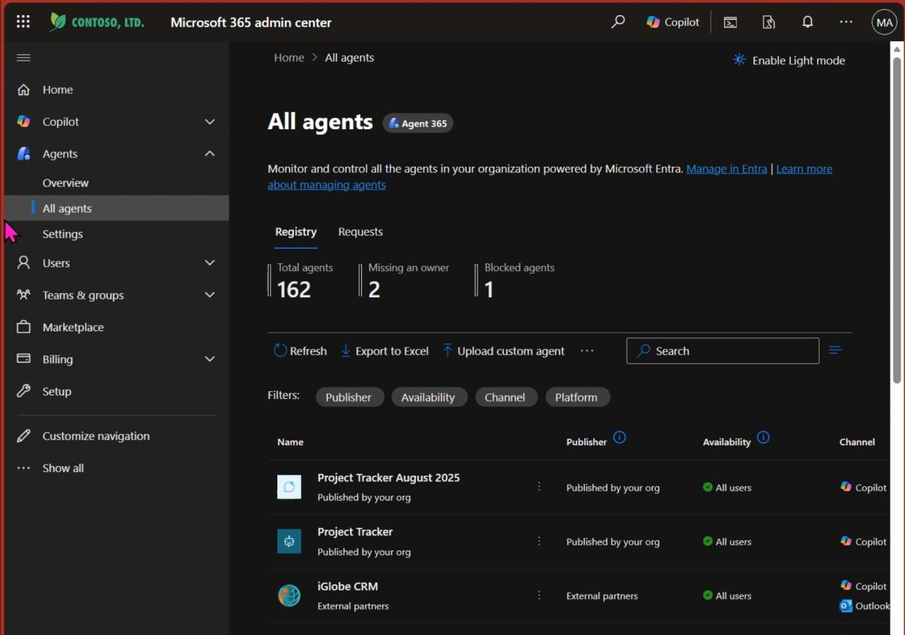
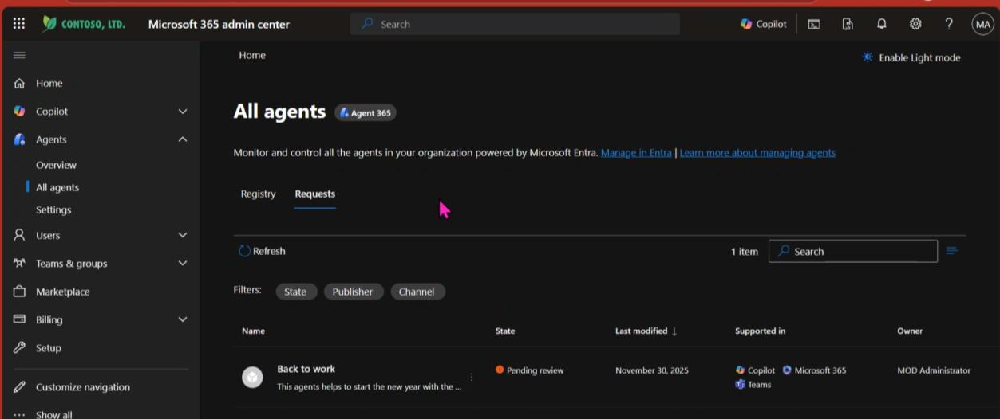
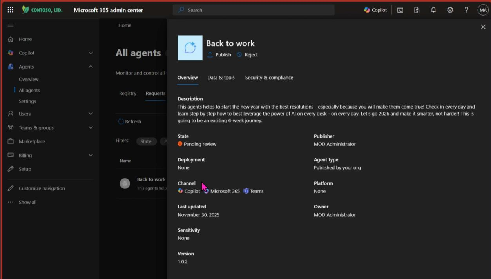
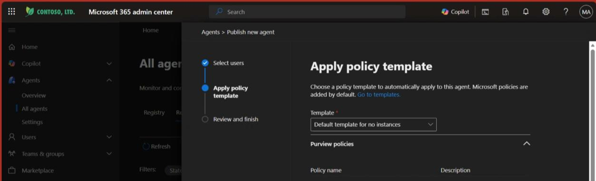
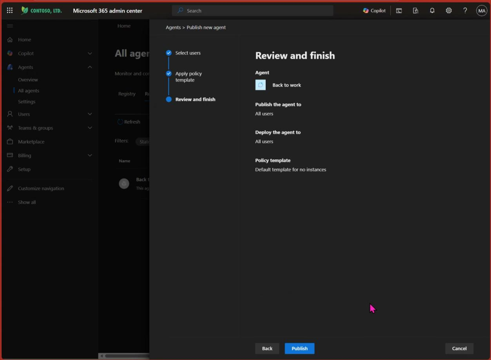
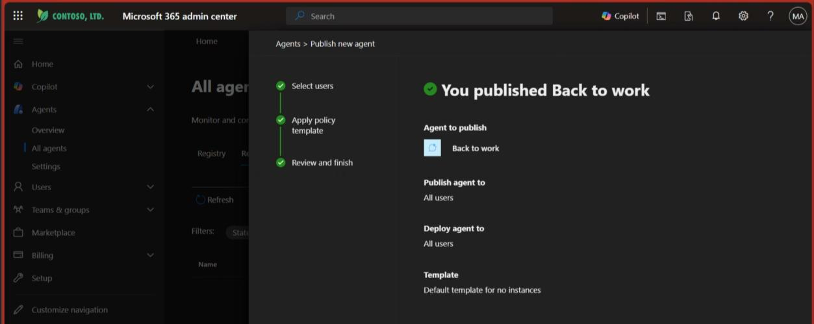
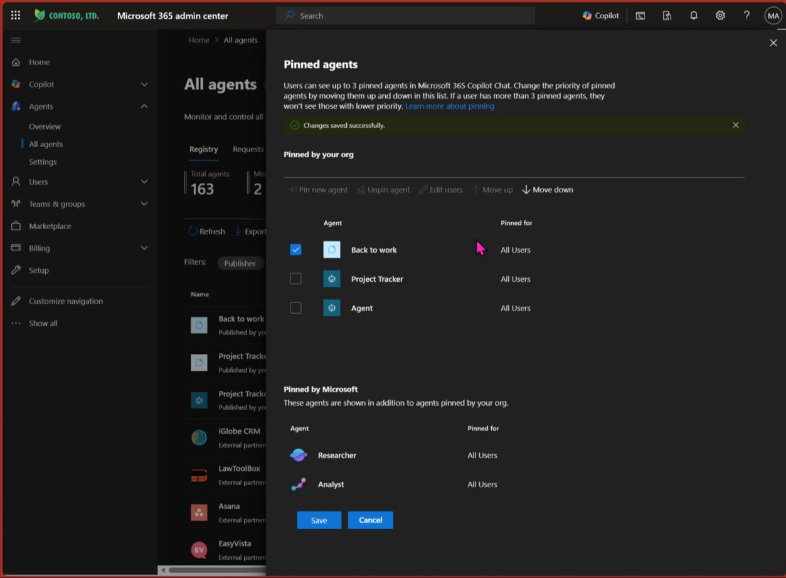

# Administrator Approval, Deploy & Pin Agent in M365 Copilot App

Now that you have imported, adjusted and published your app, it is ready to be added to the organization's app library so that others can find and use it.

An **administrator** must approve your solution and make it available to everyone. If you are the administrator — let's go!

---

## Open the M365 Admin Center

Go to [https://admin.microsoft.com/](https://admin.microsoft.com/)

In the admin center, navigate to **"All Agents"** in the left menu. You'll see a complete overview of all agents in the environment.

Click on **"Requests"** to get a list of agents requested to be approved.

---

## Approve the Agent

Find the **Back 2 Work Agent** in the requests list and click on it.

The detail page opens. If you like what you see, click **"Publish"** to start the publishing process.

---

## Deploy to Everyone

Since this is a company-wide campaign, you want the agent available for everyone:

1. **First field:** Make it available to everyone
2. **Second field:** Pre-install it for everyone so no one has to search through the agent library

Click **Next** to continue.

---

## Continue Through Wizard

Nothing to change on this screen — click **Next** to continue.

In the last step, click **"Publish"** and you are almost done!

---

## Pin the Agent for Maximum Discoverability

In the previous steps you already made the agent accessible, but it could get lost or go unseen when more agents are in active use.

To solve this, **pin the agent** to the agent menu for all users — ensuring everyone can easily access it.

Go back to **"All Agents"** in the left menu bar and click on the agent. Use the **search** functionality as needed.

---

## Pin for Users

The agent's details page opens. Click **"Pin for users"**.

Choose **"All users the agent is deployed to"** and click **"Save"**.

---

## Set Agent Order

You can now change the order in which pinned agents appear. For the campaign, the Back to Work agent should be at the **top of the list**.

If it is not — click it and move it upwards. Click **Save** to proceed.

**You're done with M365 Copilot deployment! Congratulations! 🎉**

---

**Next:** [Deploy & Pin in Teams →](deploy-pin-teams)
