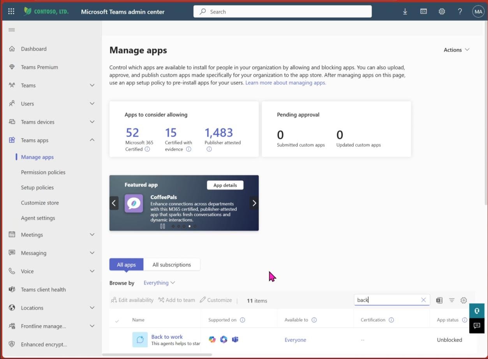
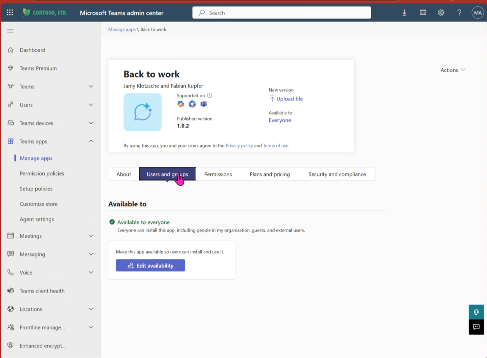
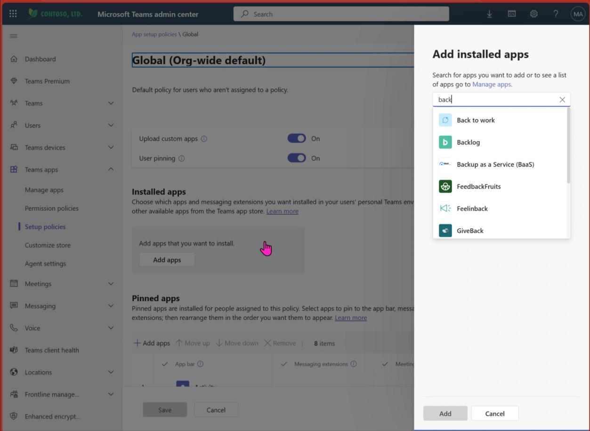
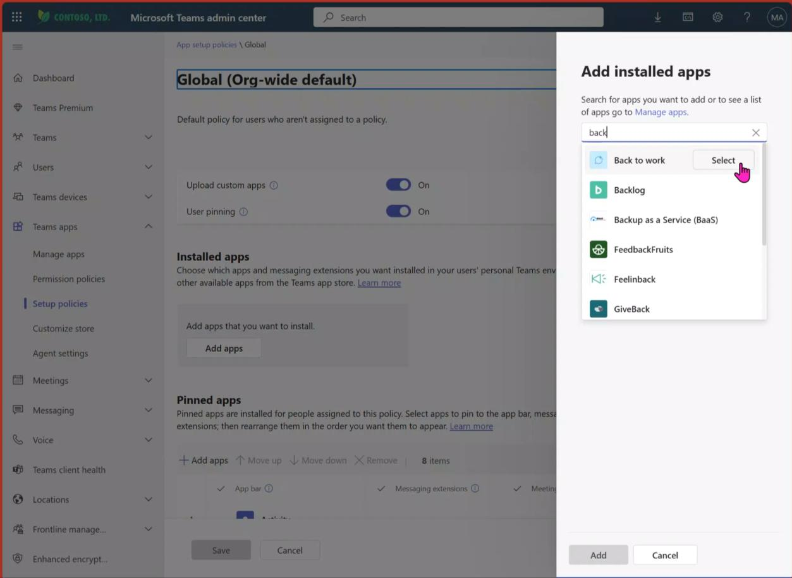
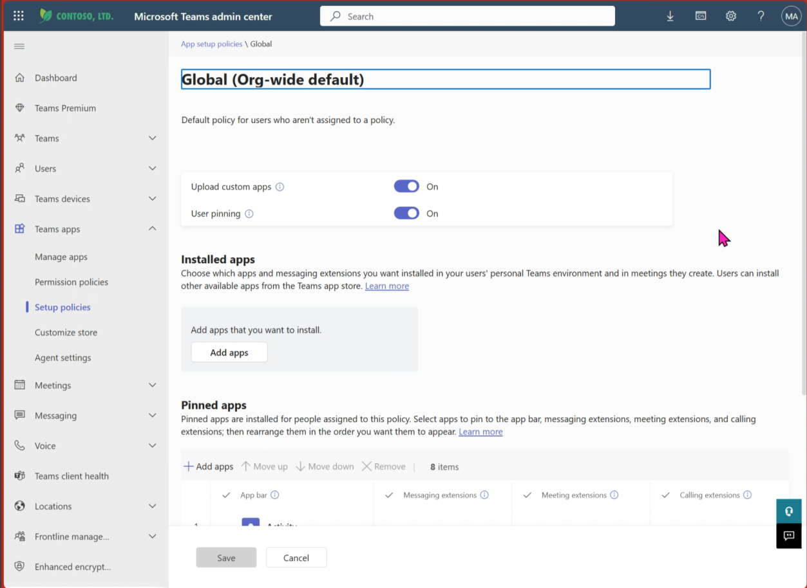
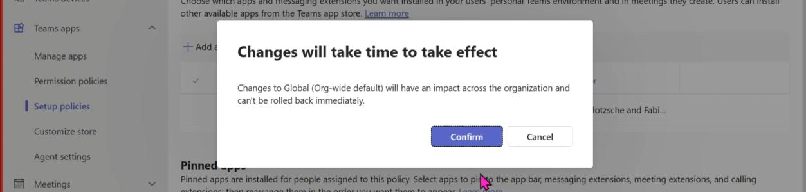

# Deploy & Pin in Teams

We are heading to the last bit of configuration. Until now your agent is imported, adjusted, published, deployed, and pinned. Awesome job!

In these last steps, we want the agent to **actively trigger users once a day** to guarantee maximum impact on everyone's daily habits.

> **Important:** You will be able to configure the frequency of active reach-outs. The standard is set to once a day.

> **Good to know:** Depending on your organization's size, the active reach-out may not appear at the same time to everyone but might be sent in chunks over the course of the day.

To give the agent the possibility to actively reach out, you will now deploy it as an **app in Teams** — which also means it appears as its own app in the Teams menu on the left.

---

## Open Teams Admin Center

Go to [https://admin.teams.microsoft.com/](https://admin.teams.microsoft.com/)

Click **"Manage Apps"** in the left menu. Find the agent in the app list (use search as needed) and click on it.

---

## Verify Availability

Check if it is **available to everyone**. This should be the case as we deployed it to everyone.

> It might take some minutes after the deployment process until it appears accordingly. If it is not the case in your environment, grab a coffee and breathe. If it still is not available, go to **"Edit availability"** and change accordingly.

---

## Setup Policies

Head over to **"Setup Policies"** in the left menu bar. Choose **"Manage Policies"** and click on the **"Global"** policy.

---

## Pin in Teams

Back in the detail view of the "Global" policy, **pin the agent** to the left menu bar.

---

## Set Agent Position

Like we did for the agent list in the M365 Copilot App, we want the Back to Work Agent to be prominent and easy to access.

Use the **"Move Up"** button to move it to a top position in the left menu in Teams. Click **"Save"** when done.

> It might take up to some hours for the changes to take effect. In some cases, the agent might appear in the menu after users have restarted their Teams client.

Click **"Confirm"** to finish the process.

---

## Agent is Now Available!

### M365 Copilot App

### Teams

The agent is pinned and pre-installed in Teams. You can interact with it in the same way as in the M365 Copilot App.

---

**Next:** [Set Up Daily Nudge →](daily-nudge)
