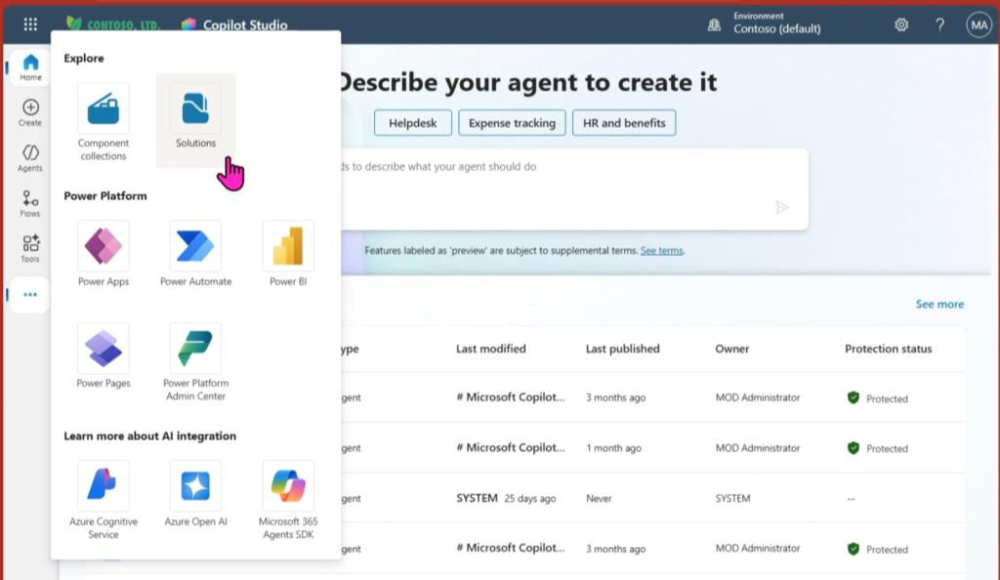
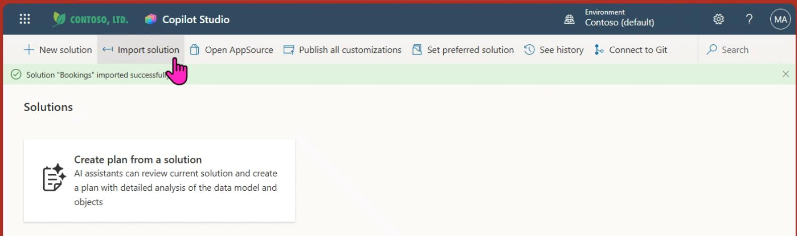
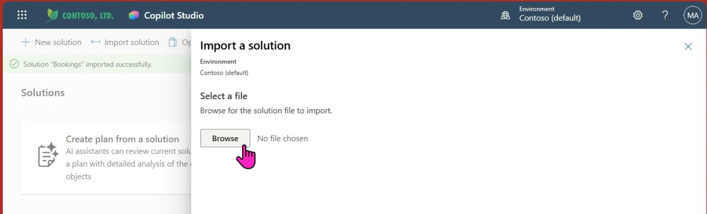
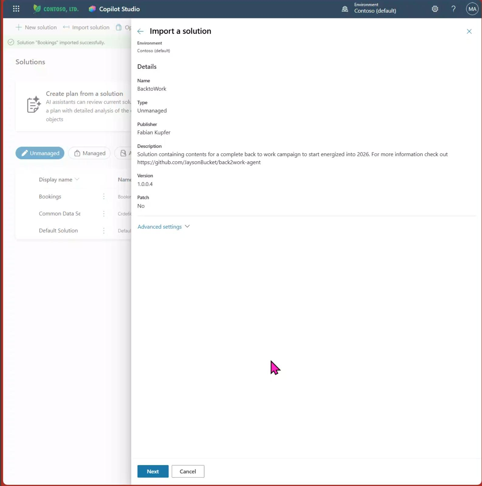
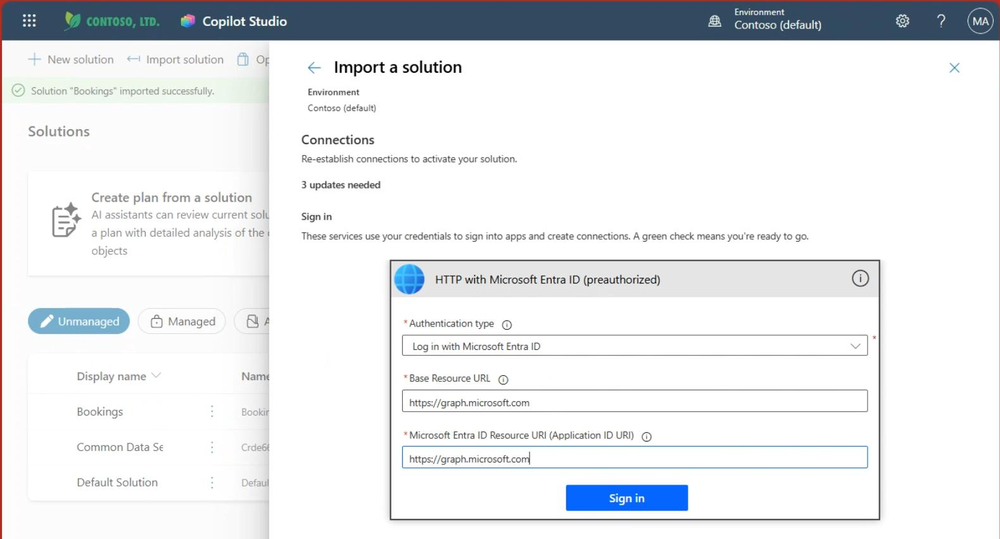
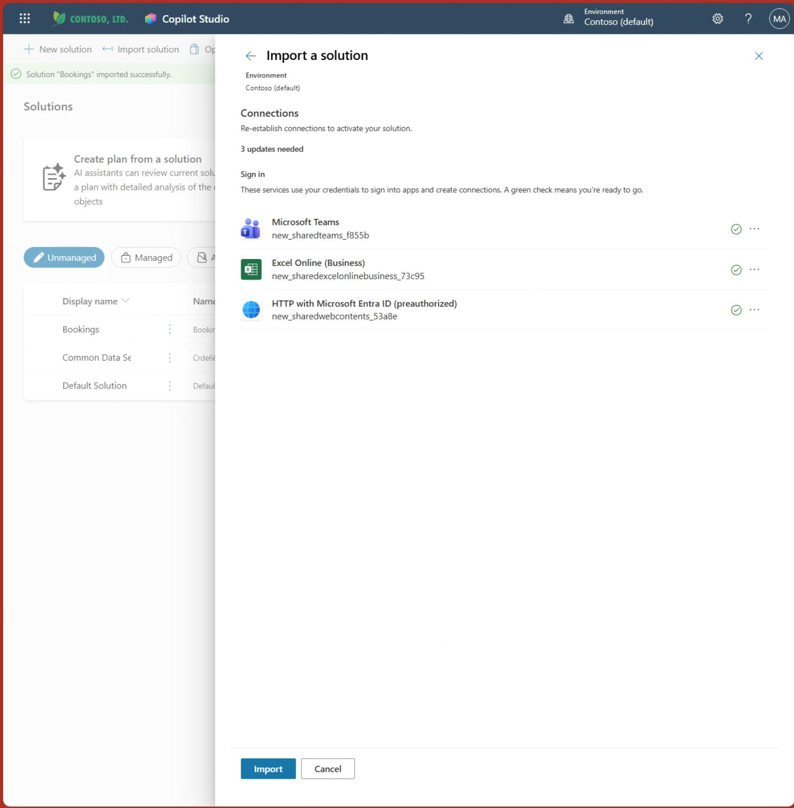

# Import Solution (Containing Agent and Flow)

## Step 1 — Download the Solution

Download the zip file from the repository (**just download, don't unpack**):
[Download from GitHub](https://github.com/JaysonBucket/back2work-with-AI-campaign)

## Step 2 — Open Copilot Studio

Go to [https://copilotstudio.microsoft.com/](https://copilotstudio.microsoft.com/)

## Step 3 — Open Solutions

Click the **ellipses** on the left menu bar and click **"Solutions"**.

## Step 4 — Import Solution

Click **"Import Solution"**.

## Step 5 — Browse and Select File

Browse and select the downloaded file.

## Step 6 — Select File and Click Next

Select the file and click **Next**.

## Step 7 — Import Overview

You will see an overview of the solution. Click **Next** to continue.

> The solution is now being imported and set up in your environment. Stay tuned, grab a coffee, breathe — it might take a minute or two until it finishes.

## Step 8 — Sign in to Services

The agent solution comes prepared with multiple possibilities. To make each option work, you need to fix the connections by signing in to the services.

Sign in to all **three services** for the Power Automate Flow.

Refer to the next step for the HTTP connection which might need to be set up from scratch.

## Step 9 — Add New Connections (if needed)

Click **"Add new connection"**:

Then configure:
- Change authentication type to **"Login with Entra ID"**
- Add `https://graph.microsoft.com` into both:
  - **Base Resource URL**
  - **Entra ID Resource URL**
- Click **"Sign in"**

## Step 11 — Final Import

All 3 checkmarks green? Then you are ready to go!

Last check — then click **"Import"** to proceed.

---

> **Note:** Current status will be discoverable on the upper side of the page. Don't be alarmed by errors thrown during or after the import process — this is totally normal and we'll fix this right away.

You've been absolutely successful when the solution appears in the list of solutions! 🎉

---

**Next:** [Test and Publish the Agent →](publish-agent)
